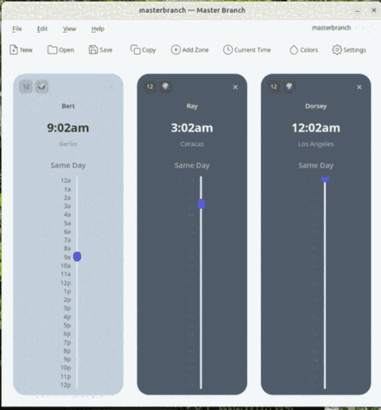

# Ufemtizm

A Qt6 desktop app for comparing and synchronising times across multiple time zones.



Ufemtizm renders each time zone as a vertical 24-hour slider next to a clock face. Drag any slider and every other zone updates in lock-step, so finding a meeting time across continents takes one motion instead of arithmetic. Runs on macOS, Windows, and Linux.

## Features

- Add as many time zones as you need; drag to reorder horizontally.
- Vertical 24-hour sliders in 15-minute increments. Moving one moves them all.
- 12/24-hour toggle and editable per-widget labels (double-click to rename).
- Day-offset indicator (`+1 day`, `-1 day`) relative to the first widget.
- Optional **sky colour theme** that tints widgets blue at night, yellow at noon, and through warm sunset tones in between. Toggle from the toolbar or `Settings → Appearance`.
- System tray with show/hide, recent files, and quick actions.
- Copy the current time across selected zones to the clipboard (`Ctrl+C` / `Ctrl+Shift+C`).

## Install

Pre-built installers are attached to each tagged release on the [Releases page](https://github.com/Master-Branch-Software/ufemtizm/releases).

### macOS

Download `Ufemtizm-<version>.dmg`, open it, and drag the app into `Applications`. The DMG is signed and notarised; no Gatekeeper override needed.

### Windows

Download `Ufemtizm-<version>.exe` and run it. The Qt IFW installer places the app and a `maintenancetool.exe` next to it; **Help → Check for Updates** uses that tool to fetch new versions.

### Linux

```bash
sudo snap install ufemtizm
```

Snap auto-refreshes in the background. If you prefer a `.deb`, build one from source with `./build_and_deploy.sh` (see below).

## Usage

Launch the app — it opens with one widget showing your local time zone.

| Action | How |
| --- | --- |
| Add a zone | `File → Add Time Zone` (`Ctrl+T`) |
| Change a zone | Click the globe icon on the widget toolbar |
| Rename a widget | Double-click the label, type, click outside to save |
| Adjust time | Drag any slider — all widgets follow |
| Remove a widget | Click `×` (one widget must remain) |
| Toggle 12/24-hour | Click the `12`/`24` button on the widget toolbar |
| Toggle sky colours | Click `Colors` on the main toolbar |
| Reorder | Drag a widget left or right |
| Copy times | `Edit → Copy` (`Ctrl+C`) opens a zone-picker dialog |

### Day offsets

Each widget shows its day offset relative to the first widget — useful when "9 AM Tokyo" is still yesterday in San Francisco.

## Build from source

### Requirements

- CMake 3.16+
- Qt 6 (Core, Widgets, Network, Svg)
- A C++17 compiler — Xcode CLT on macOS, MinGW-w64 or MSVC on Windows, GCC or Clang on Linux

### Quick build

```bash
./build_and_deploy.sh           # Linux (.deb) or macOS (unsigned .dmg)
./build_and_deploy.sh --snap    # Linux Snap package
.\build_and_deploy.ps1          # Windows (Qt IFW .exe)
```

For signed and notarised macOS builds, the tagged release workflow, S3 update channels, and the full release process, see [RELEASING.md](RELEASING.md).

### Manual build

```bash
cmake -S . -B build -DCMAKE_PREFIX_PATH=/path/to/qt -DCMAKE_BUILD_TYPE=Release
cmake --build build --config Release
```

Typical Qt prefixes: `~/Qt/6.x.x/macos`, `~/Qt/6.x.x/gcc_64`, `C:/Qt/6.x.x/mingw_xx`.

## Contributing

Issues and pull requests are welcome on [GitHub](https://github.com/Master-Branch-Software/ufemtizm). Please open an issue before starting non-trivial work so we can agree on direction.

## License

MIT — see [LICENSE](LICENSE).
