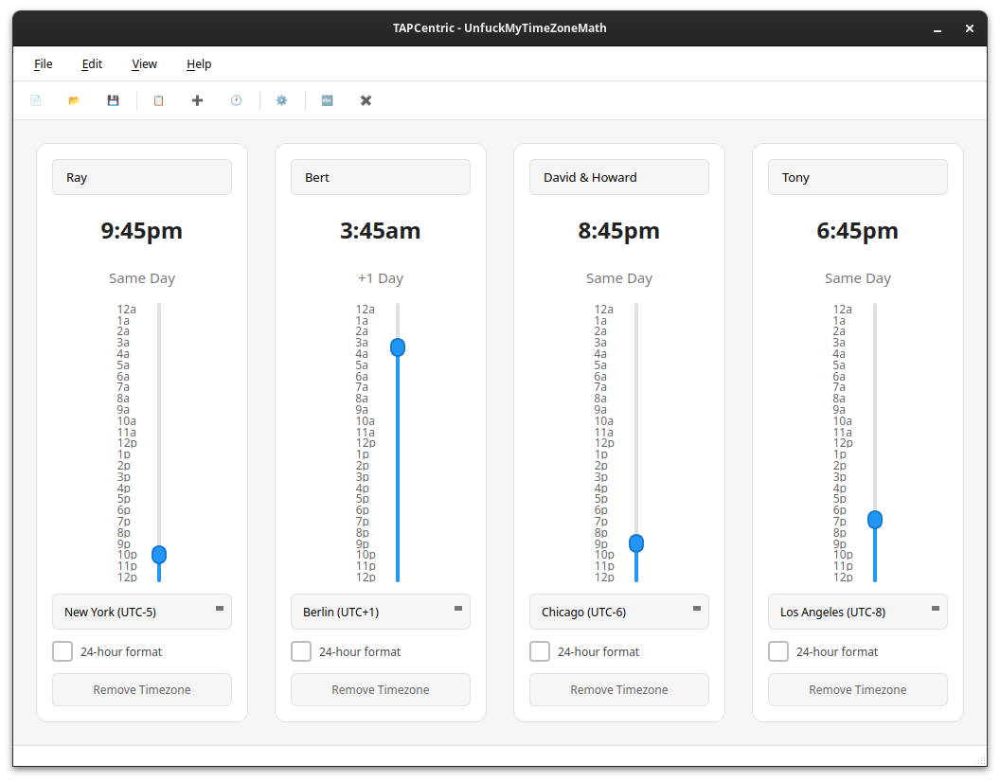

# UnfuckMyTimeZoneMath



A Qt6 application for visualizing and synchronizing times across multiple time zones. Perfect for coordinating meetings, calls, or events across different geographical locations.

## Features

### Visual Design
- **Chronos Atelier design system** - Light, airy palette with tonal elevation and indigo accents
- **Borderless cards** - Timezone tiles use 24px rounded corners with soft ambient shadows instead of borders
- **Custom thin-line SVG icons** - Monochrome toolbar, menu, and tray icons for a clean editorial look
- **Dynamic sky color theme** - Widget backgrounds change color based on time of day:
  - **Night (8 PM - 7 AM)**: Deep blue background with light text
  - **Morning (7 AM - 10 AM)**: Soft morning blue
  - **Late Morning (10 AM - 12 PM)**: Blue fading to warm yellow
  - **Noon (12 PM - 2 PM)**: Bright yellow representing peak sun
  - **Afternoon (2 PM - 5 PM)**: Yellow fading back to blue
  - **Evening/Sunset (5 PM - 7 PM)**: Blue transitioning to reddish sunset
  - **Dusk (7 PM - 8 PM)**: Sunset colors fading to night
- **Adaptive toolbar buttons** - Button backgrounds and text colors fade along with the sky color throughout the day
- **Quick toggle** - Colors button on main toolbar for instant theme on/off
- **Preference control** - Enable/disable sky colors in Settings → Appearance

### User Interface
- **Compact toolbar interface** with custom SVG icon buttons:
  - Single toggle button to switch between 12/24-hour format
  - Globe icon for quick timezone selection via dropdown menu
  - X button to remove widgets
- **Vertical time sliders** representing 24 hours with 15-minute intervals for intuitive time selection
  - Sliders fill from the bottom to visually indicate time progression
  - Right-aligned time labels for cleaner appearance
- **Double-click to edit names** - Widget names display as labels and become editable on double-click
  - Click anywhere outside the field to save and exit edit mode
- **Clear time and timezone display**:
  - Large, centered time display in your chosen format
  - Timezone name shown below the time
  - Day offset indicator showing relative day differences between zones (e.g., "+1 day", "-1 day")

### Functionality
- **Comprehensive time zone selection** with organized dropdown containing major cities worldwide
- **Multiple time zone widgets** - add as many as you need
- **Synchronized sliders** - moving any slider updates all others automatically
- **Drag and drop reordering** - click and drag widgets to reorder them horizontally
- **System tray integration** - minimize to tray for quick access
  - Double-click tray icon to show/hide window
  - Right-click for context menu with recent files and quick actions

## Supported Platforms

- **macOS** 10.14+
- **Linux** (Ubuntu, Debian, Fedora, etc.)
- **Windows** 10/11

## Requirements

- CMake 3.16 or later
- Qt6 (Core, Widgets, Network, and Svg modules)
- C++17 compatible compiler
- Platform-specific tools:
  - **macOS**: Xcode Command Line Tools
  - **Linux**: build-essential, dpkg
  - **Windows**: MinGW-w64 (preferred) or Visual Studio 2019+

**Note**: For detailed MinGW setup and build instructions, see **[MINGW_BUILD.md](MINGW_BUILD.md)**.

## Quick Installation

### Pre-built Installers

Download the installer for your platform from the [releases page](https://github.com/Master-Branch-Software/UnfuckMyTimeZoneMath/releases)

- **macOS**: `unfuck-my-timezone-math-1.0.0-Darwin.dmg`
- **Linux**: `unfuck-my-timezone-math-1.0.0-Linux.deb`
- **Windows**: `unfuck-my-timezone-math-1.0.0-win64.exe`

#### macOS Installation

1. Download and open the `.dmg` file
2. Drag the app to your Applications folder
3. Launch from Applications or Launchpad

#### Linux Installation (Ubuntu/Debian)

```bash
sudo dpkg -i unfuck-my-timezone-math-1.0.0-Linux.deb
sudo apt-get install -f  # Install any missing dependencies
```

#### Windows Installation

1. Download and run the `.exe` installer
2. Follow the installation wizard
3. The installer will:
   - Install the application to `C:\Program Files\UnfuckMyTimeZoneMath`
   - Create a Start Menu shortcut
   - Bundle all required Qt dependencies
4. Launch from Start Menu or desktop shortcut

**Note**: NSIS (Nullsoft Scriptable Install System) is required to create the Windows installer. If NSIS is not installed, the build script will create a ZIP package instead.

## Building from Source

### Quick Build (All Platforms)

The easiest way to build is using the automated script:

**Linux/macOS:**
```bash
./build_and_deploy.sh
```

**Windows (PowerShell):**
```powershell
.\build_and_deploy.ps1
```

These scripts automatically:
- Detect your operating system
- Find your Qt installation (preferring MinGW on Windows)
- Build the application
- Deploy Qt dependencies
- Create a platform-specific installer

### Manual Build

For detailed build instructions, platform-specific requirements, and troubleshooting, see **[BUILD.md](BUILD.md)**.

#### Quick Manual Build

```bash
mkdir build
cd build
cmake -DCMAKE_PREFIX_PATH=/path/to/qt -DCMAKE_BUILD_TYPE=Release ..
cmake --build . --config Release
```

**Qt paths by platform:**
- **macOS**: `~/Qt/6.x.x/macos` or `/opt/homebrew/opt/qt`
- **Linux**: `~/Qt/6.x.x/gcc_64` or system Qt6
- **Windows**: `C:/Qt/6.x.x/msvc2019_64` or `C:/Qt/6.x.x/mingw_xx`

## Usage

### Getting Started

1. Launch the application - it starts with one time zone widget showing your system's local time zone
2. Use **File → Add Time Zone** from the menu to add additional time zone widgets
3. Each widget displays:
   - A friendly name (editable by clicking)
   - The selected time zone
   - Current day and time
   - Day offset relative to other zones
   - A vertical slider for time adjustment

### Working with Time Zones

- **Add a time zone**: File → Add Time Zone (or Ctrl+T)
- **Change time zone**: Click the globe icon (🌍) in the widget toolbar and select from the menu
- **Rename widget**: Double-click on the friendly name and type a new name. Click anywhere outside to save
- **Adjust time**: Drag any slider up or down - all widgets update automatically to show the corresponding time
- **Remove widget**: Click the X button in the widget toolbar (minimum one widget must remain)
- **Toggle format**: Click the format button (shows "12" or "24") in the widget toolbar to toggle between 12 and 24-hour time display
- **Toggle sky colors**: Click the Colors button on the main toolbar to instantly enable/disable the sky color theme
- **Reorder widgets**: Click and drag any widget to reorder them horizontally
- **Copy to clipboard**: Use Edit → Copy (Ctrl+C) to copy timezone information. A dialog lets you select which timezones to include, with an option to skip the dialog in the future
- **Copy selected**: Use Edit → Copy Selected (Ctrl+Shift+C) to always show the selection dialog, regardless of the "Don't show again" preference

### Sky Color Theme

The optional sky color theme provides visual context for time of day:

- **Smooth color transitions** - Background colors gradually fade as you move the time slider, creating a natural progression through the day
- **Adaptive text colors** - Text automatically switches between black and red for optimal readability against changing backgrounds
- **Coordinated button colors** - Widget toolbar buttons dynamically adjust their background and text colors to match the sky theme
- **Quick toggle** - Use the Colors button on the main toolbar or visit Settings → Appearance to enable/disable the feature
- **Saves your preference** - Your color theme choice persists across application restarts

### Understanding Day Offsets

Each widget shows a day offset indicator (e.g., "+1 day", "same day", "-1 day") that displays the relative day difference from the first widget. This helps you quickly identify when a specific time falls on a different calendar day in another time zone.

### Example Use Cases

- **Scheduling international meetings**: Add time zones for all participants to find a suitable time
- **Travel planning**: Compare your home time with your destination
- **Remote team coordination**: Keep track of your colleagues' local times
- **Customer support**: Understand when customers in different regions are active

## File Structure

```
UnfuckMyTimeZoneMath/
├── CMakeLists.txt                    # Cross-platform build configuration
├── README.md                         # This file
├── BUILD.md                          # Detailed build instructions
├── MINGW_BUILD.md                    # MinGW-specific build instructions
├── build_and_deploy.sh               # Automated build script (Linux/macOS)
├── build_and_deploy.ps1              # Automated build script (Windows)
├── mingw-toolchain.cmake             # MinGW cross-compilation toolchain
├── main.cpp                          # Application entry point
├── mainwindow.hpp/cpp                # Main window implementation
├── timezonewidget.hpp/cpp            # Time zone widget implementation
├── settingsdialog.hpp/cpp            # Settings dialog implementation
├── copydialog.hpp/cpp                # Copy selection dialog
├── toolbar-icons/                    # Custom thin-line SVG toolbar icons
├── unfuck-my-timezone-math.desktop   # Desktop entry file (Linux)
├── installers/                       # Pre-built installers (DMG, DEB, EXE)
└── build/                            # Build directory (created during build)
```

## License

This project is open source. Feel free to modify and distribute.

## Contributing

Contributions are welcome! Feel free to submit issues or pull requests.

## Troubleshooting

For comprehensive troubleshooting guides, see **[BUILD.md](BUILD.md#troubleshooting)**.

### Common Issues

**Qt6 not found during build:**
- Install Qt from [qt.io/download](https://www.qt.io/download)
- Set `QT_PATH` environment variable
- Or specify path: `cmake -DCMAKE_PREFIX_PATH=/path/to/qt ..`

**Application won't start (Linux):**
```bash
sudo apt-get install -f
```

**System tray issues:**
- See [PLATFORM_FIXES.md](PLATFORM_FIXES.md) for detailed platform-specific troubleshooting
- Linux: On first show from tray, window may flash black (use right-click menu 'Show Window')
- Windows: Use double-click on tray icon to show/hide window
- Linux/macOS: Single click on tray icon to show/hide window

**Time zones not displaying correctly:**
- Ensure your system time zone database is up to date
- **Linux**: `sudo apt-get install tzdata`
- **macOS**: System updates handle this automatically
- **Windows**: Check Windows Updates
